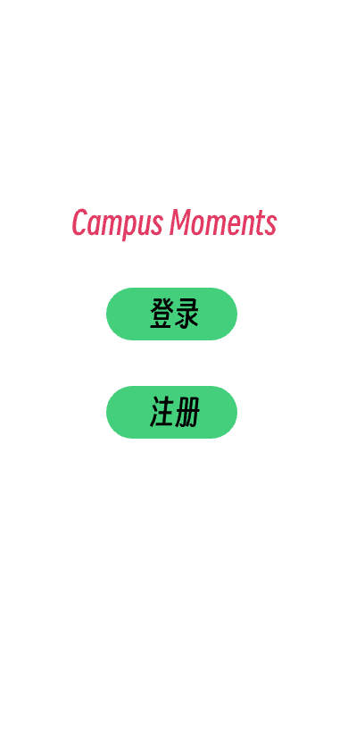
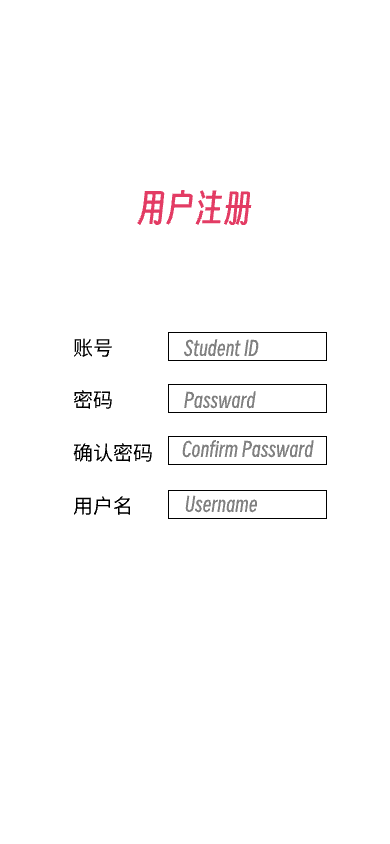
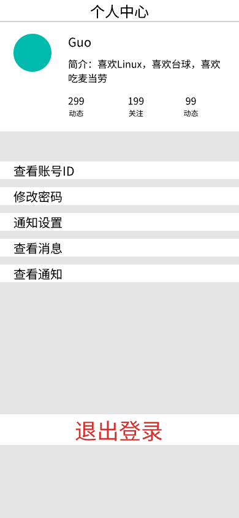
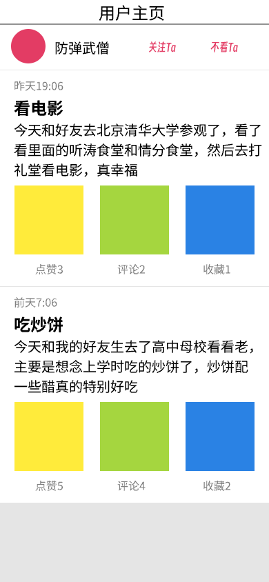
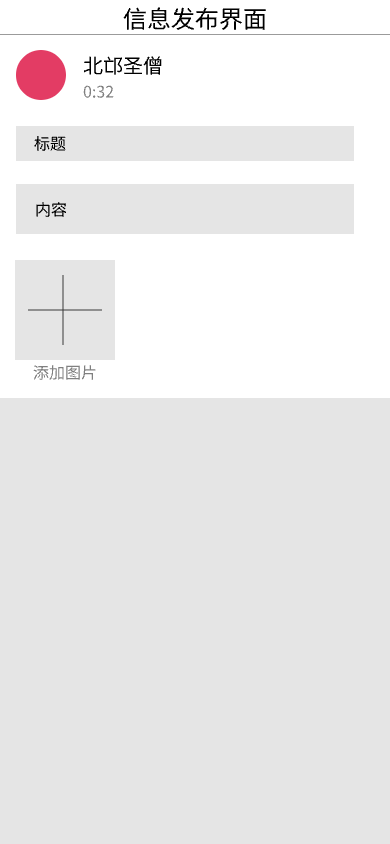
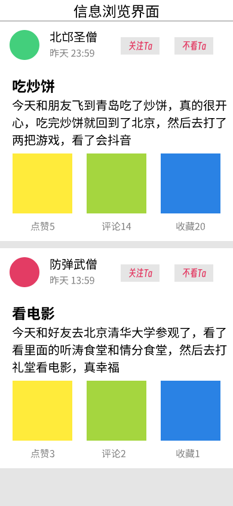
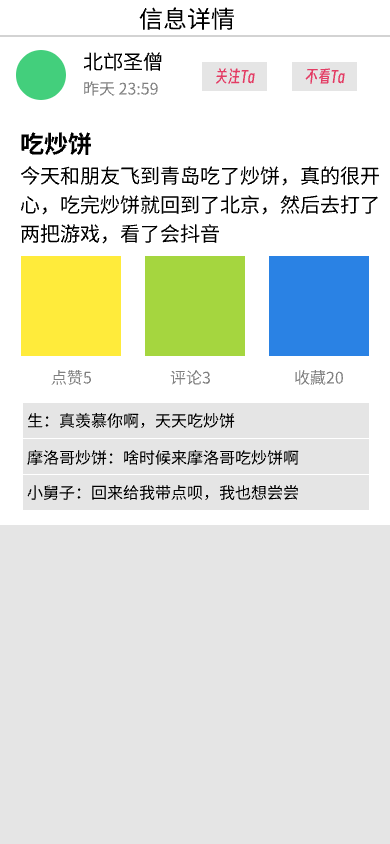
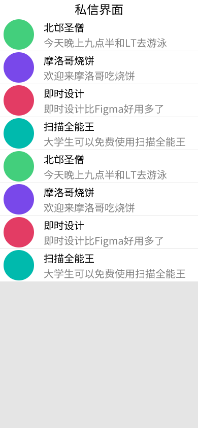

# 需求和设计文档

王政 郭恩惠 徐霈然

### 1. 简介

信息的发布与获取是校园生活的重要的组成部分，也与学校管理和学生的学习生活质量息息相关。虽然现已有如info的官方信息发布平台以及各种公众号，但仍有一些不足，例如info上的信息需要经过审核和审批等多个环节、较为滞后；info上的信息较为官方，无法覆盖学生生活的方方面面；公众号上信息较为分散和碎片化；信息流动单向，无法提供丰富的互动和交流等。因此，我们希望设计一个以学生为主体的、综合的非官方校内信息发布平台，来提高信息聚合度，打破信息茧房，降低获取信息的时间、金钱成本，让所有同学都能各取所需，及时而充分享受学校的各种便利资源，提高校园生活质量；同时它还要兼具社交功能，为学生表达想法、分享生活、解决问题等提供一个媒介，使学生加强彼此之间的联系、在校园生活中获得归属感与认同感。

### 2. 综合描述

##### 2.1 典型用户分析

本产品是以学生为主体并且面向学生的动态发布平台，因此主要用户就是学生，此外也包括部分校内教职工和其它人员。这类用户通常具有较好的软件理解能力和操作能力，并且使用过类似的应用，如公共平台微博、贴吧、小红书，以及学校内部的1911星球和树洞等，因此对类似应用的操作较为熟悉。以下使用的“用户”均指代该类用户。

##### 2.2 产品主要功能

1. 注册账号，并对用户信息进行编辑修改。

2. 浏览其他用户发布在平台上的动态，并以不同的类型、排序方式或关键词进行查看。
3. 发布含有文字、图片、以及视频的多种动态，并以不同的动态类型发布到平台上。

4. 对发布的动态内容进行点赞、收藏、评论以及分享操作。

5. 关注或拉黑其他用户、与关注的用户进行私信聊天、浏览其他用户发布动态的时间线。

### 3. 详细需求

#### 3.1 功能需求

本小节包含了Campus Moments的功能需求。

###### 3.1.1 注册与登录

1. 用户可以通过手机号码或邮箱进行注册，注册需要验证身份并完善个人资料，包括用户名、头像、简介、密码等。
2. 用户可以在设置修改个人信息，包括用户名、头像、简介、密码等。
3. 用户可以使用已注册的手机号码或邮箱进行登录，登录后可以使用平台的全部功能。

###### 3.1.2 用户信息查看

1. 用户可以在自己与其它用户的个人主页查看个人信息、发布的所有历史动态等。
2. 用户可以在个人主页查看自己的关注列表和黑名单。

###### 3.1.3 二级菜单

用户可以在动态浏览、评论等页面通过点击头像或用户名区域进入其它用户的个人主页。

###### 3.1.4 动态发布

用户可以在动态发布页面发布含有多种类型内容组合的动态，包括部分markdown格式标记的文字，从相册中选择或调用相机拍摄的图片和视频，用户位置以及动态类型等。

###### 3.1.5 动态查看

1. 用户可以根据动态的不同属性浏览需要的动态，包括只看关注、热榜、只看特定动态类型等。
2. 用户可以根据动态的发布时间、点赞量、评论量对动态进行排序。
3. 用户可以点击动态区域进入动态详情页面，查看动态的完整内容，包括完整的富文本信息、点赞收藏数、按时间排序的所有评论信息。
4. 用户可以在动态浏览、收藏动态列表等页面进行搜索，搜索的关键词在发布信息的标题、类别、内容、用户名中进行匹配，只展示匹配的动态。
5. 用户可以利用空格和”+“等进行多关键词联合搜索。

###### 3.1.6 动态操作

1. 用户可以对动态进行点赞或取消点赞，收藏或取消收藏，进行文字评论，以及分享到其它应用。

2. 用户可以在收藏动态列表页面查看所有收藏的动态。

###### 3.1.7 私信与通知

1. 用户可以在其它用户的个人主页发起私信，私信支持文字内容。
2. 用户间可以通过私信对话，并能显示历史私信记录。
3. 用户可以选择在收到私信、信息被点赞、回复以及关注的用户发布新信息时接收来⾃平台的通知消息。
4. 用户从个⼈中⼼界⾯进⼊通知消息列表，可以查看通知详情或回复私信。

###### 3.1.8 UI与交互

1. 用户能够轻松在实现了完整功能的系统的各个页面进行交互和跳转。应至少包括以下页面：动态浏览页面、动态详情页面，动态发布页面、设置页面、收藏动态列表页面、个人主页及其他用户主页、私信界面、关注与被关注和黑名单用户列表界面。
2. 在内容加载或界面切换时使用动画，使用户拥有良好的交互体验。

#### 3.2 性能需求

启动时间：应用启动应当$\le$2秒；

编辑响应时间：编辑相应时间应当$\le$1秒；

平均响应时间：简单功能的平均响应时间应当$\le$2秒，复杂查询的平均响应时间$\le$5秒；

事务成功率$\ge$99%。

#### 3.3 质量需求

可用性：用户群体应当可以在15分钟内完全掌握产品的操作和使用。

可扩展性：前后端文件分布明确，可以较方便地添加新功能。

可靠性：软件能够长时间正常运行，支持多用户登录使用。

易用性：要求页面美观

安全性：应当对敏感数据进行加密或本地存储。

### 4. 系统设计

#### 4.1 系统架构技术和选型

系统采用前后端分离的架构：

1. Android应用开发：使用Java语言和Android SDK进行原生开发，并使用Android Studio作为开发工具。
2. 后端API开发：使用Django框架和Django REST framework编写API服务，并使用Python语言进行开发。
3. 数据库：使用MySQL作为系统的关系型数据库。
4. 服务器部署：使用Nginx作为反向代理服务器，并将应用和依赖项打包成一个独立的Docker容器，便于部署和管理。

#### 4.2 功能页面设计

    
    
    
    
    
    
    
	
    

